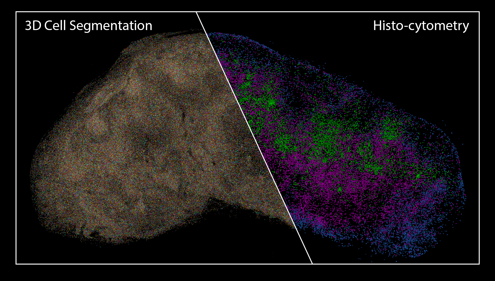

# 3D Image Processing and Analysis Pipeline

This pipeline leverages the NIH Biowulf High-Performing Computation (HPC) cluster for distributed processing of large volumetric 3D imaging datasets. The current workflow is optimized for SLURM-based scheduling system, with effort in porting to cloud-based service (e.g. Amazon AWS) currently ongoing.

## Requirements:

This workflow requires a Conda-based virtual environment and utilizes the following packages: `dask distributed`, `dask-jobqueue` for HPC-based distributed processing, and `h5py`, `zarr` for parallel read/write access.

The current supported image format is Imaris file (`.ims`), with limited support for TIFF images (`.tif`).

Cell segmentation module additionally requires the installation of [StarDist](https://github.com/stardist/stardist) package, preferably with GPU support enabled to accelerate prediction step. The subsequent CPU-intensive non-maximal suppression and labeling steps have been modified to be executed on the HPC cluster.

**Instructions for [Segmentation](doc/segmentation_tutorial.md) steps**   
**Instructions for [Data Extraction](doc/data_extraction_tutorial.md) step**

